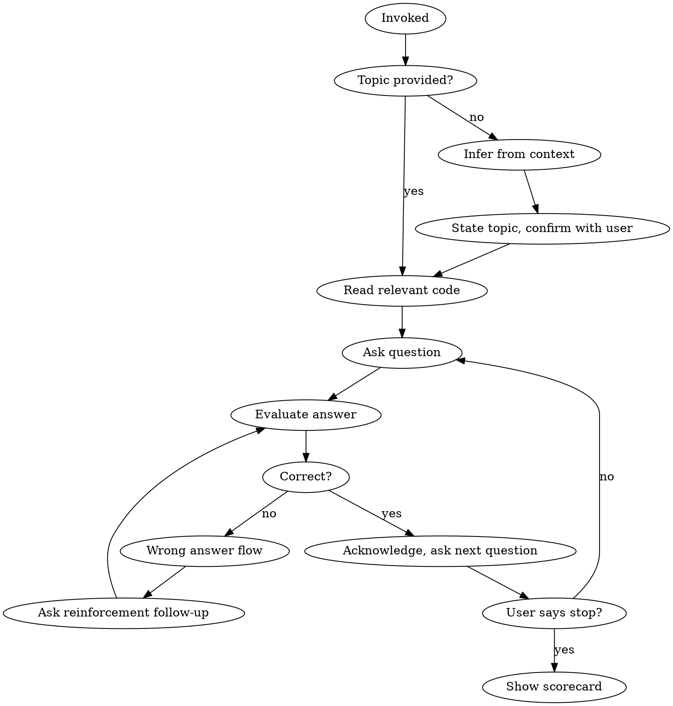

# QuizMe - Interactive Architecture Quiz

## Overview

Quiz the user on codebase architecture through interactive Q&A. Infer topic from current context or accept an explicit topic. Ask a mix of multiple-choice and free-write questions grounded in actual code. Act as a helpful guide -- when the user gets something wrong, explain why, teach the correct answer, and reinforce with a follow-up.

## Invocation

- `/quizme` -- infer topic from current branch, recent conversation, or files touched
- `/quizme <topic>` -- quiz on an explicit topic

## Process



### Step 1: Determine Topic

If no topic argument provided:
1. Look at current branch name, recent files in conversation, and discussion context
2. State what you think the user is working on: "It looks like you're working on **X**. Want me to quiz you on that?"
3. Wait for confirmation before proceeding

If topic argument provided, proceed directly.

### Step 2: Read the Code

Read relevant packages, services, and key files to understand:
- Component boundaries and responsibilities
- Design patterns in use
- Data flow between layers
- Key terminology (class names, service names, pattern names)

**Important:** You are building questions about architecture, not about files. Read code to ensure accuracy, but quiz on concepts.

### Step 3: Generate Quiz Plan

After reading the code, generate a quiz plan covering all key areas of the topic. Write it to `.claude/quizme-plan.md`. The plan ensures comprehensive coverage and lets the user resume across sessions.

**Plan format:**

```markdown
# QuizMe: [Topic Name]
Started: [date]

## Areas to Cover

- [ ] **1. Component Boundaries** -- what each piece owns, where responsibilities split
- [ ] **2. Data Flow** -- how data moves between layers and components
- [ ] **3. Design Patterns** -- patterns in use, why they were chosen
- [ ] **4. Key Terminology** -- correct names for components, services, concepts
- [ ] **5. Error Handling** -- how failures propagate, recovery strategies
- [ ] **6. Integration Points** -- how this connects to the rest of the system

## Progress
<!-- Updated as areas are covered -->
| Area | Questions Asked | Correct | Notes |
|------|----------------|---------|-------|
```

**Plan rules:**
- Generate 4-8 areas based on actual code complexity. Don't pad with filler.
- Each area should map to a meaningful concept cluster, not a file.
- Check off areas once 2+ questions in that area have been answered.
- If a plan already exists for this topic, read it and resume. Ask: "We have an existing quiz on **X** -- want to continue where you left off, or start fresh?"

### Step 4: Ask Questions

Alternate between two question types:

**Multiple choice** -- for terminology and concept identification:
- "What design pattern does the execution engine use for node processing?"
- "Which package is responsible for defining shared API contracts between frontend and backend?"
- Use 3-4 options. Make distractors plausible but distinguishable.

**Free-write** -- for architectural understanding:
- "In your own words, how does a workflow execution get triggered and flow through the system?"
- "What is the role of the event bus in this architecture?"
- Expect the user to use correct terminology. If they use wrong terms, correct them gently.

**Question principles:**
- Target component relationships, data flow, design patterns, layer responsibilities
- Use real class/service/package names from the codebase
- Never ask about specific line numbers or file paths
- Increase difficulty gradually -- start with broad architecture, move toward nuanced interactions
- One question per message. Wait for the answer.
- Draw questions from uncovered plan areas first. Once an area has 2+ answered questions, check it off and move to the next.

**Progress indicator:** Include a progress line before each question:

> `[2/6 areas covered]` -- you've nailed component boundaries and data flow. Next up: design patterns.

- Show as `[X/Y areas covered]` where X is checked-off areas and Y is total.
- Keep it to one line.
- Include it every question so the user always knows where they stand.
- When most areas are covered, mention it: "Almost done -- just **Error Handling** left."

### Step 5: Evaluate Answers

**If correct:**
- Brief acknowledgment ("Right!" or "Exactly.")
- Optionally add a small bonus insight the user might not know
- Move to the next question

**If wrong -- 3-step flow:**
1. **Explain why wrong:** "That's not quite right. [X] doesn't [do what you said] because [reason]."
2. **Explain the correct answer:** "What actually happens is [correct explanation]. The term for this is [correct terminology]."
3. **Reinforcement follow-up:** Ask a related question that tests the same concept from a different angle. This must be answered before moving on.

**Tone:** Helpful guide, not examiner. Frame corrections as "here's what's actually happening" not "you're wrong."

### Step 6: End Session and Scorecard

When the user says "stop", "done", "enough", or similar:

Produce a scorecard grouped by concept area:

```
## Quiz Summary

### Areas Covered

| Area | Rating | Notes |
|------|--------|-------|
| Data Flow | Strong | Correctly traced execution from trigger to completion |
| Terminology | Needs Work | Confused "controller" with "service" in several answers |
| Design Patterns | Decent | Got DI right, but missed event-driven communication pattern |

### Where to Dig Deeper
- **Terminology:** Look at `packages/cli/src/controllers/` vs `packages/cli/src/services/` to see the distinction in practice
- **Event patterns:** Check the event bus implementation in `packages/cli/src/events/`
```

**Scorecard principles:**
- Rate each area: Strong / Decent / Needs Work
- For weak areas, point to relevant code areas (package/directory level, not specific files)
- Keep tone encouraging -- highlight strengths alongside gaps
- Note which plan areas were covered and which remain
- End with a one-line overall assessment

The quiz plan persists at `.claude/quizme-plan.md` with progress marked -- the user can resume in a future conversation by invoking `/quizme` on the same topic.

## Key Rules

- **One question per message.** Never batch questions.
- **Always read actual code** before asking questions. Don't invent architecture.
- **Care about terminology.** If the user says "handler" when they mean "controller", correct it.
- **Free-write questions should require articulation**, not just yes/no recall.
- **Reinforcement follow-ups are mandatory** after wrong answers. Don't skip them.
- **Never quiz on file paths or line numbers.** Architecture, patterns, data flow, and terminology only.
