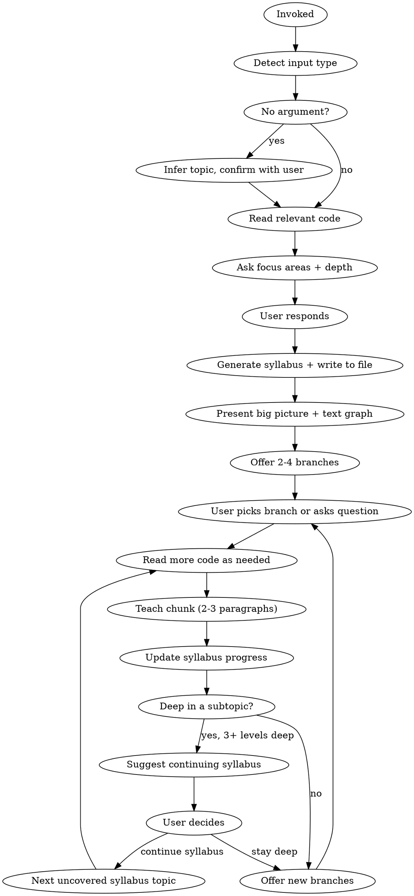

# TeachMe - Interactive Codebase Exploration

## Overview

Guided, opinionated teaching through interactive conversation. Always starts top-down (big picture first), presents information in short bursts with branching options, and actively calls out what's strong, weak, unusual, or missing. The user steers depth and direction -- a "choose your adventure" through code.

## Invocation

- `/teachme` -- infer topic from current context (branch, conversation, files touched)
- `/teachme <concept>` -- e.g., `/teachme execution engine`
- `/teachme <file-path>` -- e.g., `/teachme packages/cli/src/services/execution.service.ts`
- `/teachme <PR>` -- e.g., `/teachme #4521` or a GitHub PR URL

## Input Detection

| Input | Detection | Entry Point |
|-------|-----------|-------------|
| No argument | Infer from branch/context, confirm with user | Big picture of inferred area |
| Concept | No path prefix, no `#` or URL | Big picture of that system/pattern |
| File path | Path-like string, verify exists | Big picture of the system the file belongs to, then narrow to the file |
| PR | `#number` or GitHub URL, fetch via `gh` | Big picture of area touched, then what changed and why |

## Process



### Step 1: Determine Topic

**No argument:** Check current branch name, recent files, discussion context. State inference: "It looks like you're working on **X**. Want me to teach you about that area?" Wait for confirmation.

**With argument:** Detect type (concept, file, PR) and proceed.

### Step 2: Read Code and Build Understanding

Read relevant packages, services, dependencies, and callers. For PRs, also fetch via `gh pr view` and `gh pr diff`. Build a mental model of:
- Component boundaries and responsibilities
- Key dependencies and data flow
- Design patterns in use
- Gaps in the design (missing validation, error handling, tests, etc.)

### Step 2.5: Ask Focus Areas, Depth, Abstraction Level, and Notes

After reading the code, before generating the syllabus, ask the user what they want to focus on, how deep they want to go, how code-specific explanations should be, and whether to record notes. Present this as a single combined question.

Based on your code reading, surface 4-6 meaningful focus area suggestions specific to the topic -- not generic categories, but real areas you found in the code.

Example prompt (adapt to the actual topic):

> Before I build your syllabus, four quick questions:
>
> **What areas do you want to focus on?** (pick one or more, or say "all")
> - **A) Core execution flow** -- how workflows run end-to-end
> - **B) Error handling & recovery** -- failure modes and what's missing
> - **C) Node runner architecture** -- how individual nodes are dispatched
> - **D) Trigger integration** -- how executions get initiated from outside
> - **E) Testing coverage** -- what's tested, what's not
>
> **How deep do you want to go?**
> - **1) Survey** -- big picture only, key concepts, how it fits in (~15 min)
> - **2) Standard** -- balanced breadth and depth, main patterns and flows
> - **3) Deep dive** -- internals, edge cases, design gaps, full coverage
>
> **How code-specific should explanations be?**
> - **I) Conceptual** -- concepts, responsibilities, and flows only; no class/function/file names
> - **II) Named** -- use real class, service, method, and package names inline (no code blocks unless asked)
> - **III) Code-level** -- real names plus proactive code snippets when they add clarity
>
> **Record notes throughout the session?** (default: yes)
> - **Y) Yes** -- save a running notes document to `~/.claude/teachme/<topic>-notes.md` as we go
> - **N) No** -- skip notes; session is ephemeral

Wait for the user's response before generating the syllabus.

**Scoping rules based on response:**
- **Focus areas:** Restrict syllabus items to chosen areas unless the user says "all". If the user picks a subset, drop or deprioritize unrelated items.
- **Survey depth:** 3-5 high-level items. Each broad. Cover only high-level concepts; include internals and gaps/critique only when explicitly chosen.
- **Standard depth:** 5-7 items. Mix of overview and key patterns. Include one gap/critique item if relevant.
- **Deep dive depth:** 7-10 items. Include internals, edge cases, design gaps, and testing strategy. Nothing skipped.
- **Conceptual abstraction:** Describe responsibilities, flows, and patterns without naming specific classes, methods, or files. Good for architectural understanding without code navigation.
- **Named abstraction:** Reference real class/method/package names inline throughout. Show code blocks only when the user explicitly asks. (Default behavior.)
- **Code-level abstraction:** Use real names and proactively include relevant code snippets when they make an explanation clearer -- don't wait for the user to ask.

### Step 3: Generate Syllabus

After reading the code, generate a syllabus covering all key parts of the topic. Write it to `~/.claude/teachme/<topic-slug>.md` (e.g., `~/.claude/teachme/execution-engine.md`). Derive the slug from the topic name -- lowercase, hyphens, no special characters. The syllabus serves two purposes: ensuring comprehensive coverage, and letting the user resume across sessions.

If the user opted in to notes (the default), also create a companion notes document at `~/.claude/teachme/<topic-slug>-notes.md`. This is a running knowledge base that accumulates everything taught across the session -- updated after every teaching chunk, not just at the end. Skip this file entirely if the user said no.

**Syllabus format:**

```markdown
# TeachMe: [Topic Name]
Started: [date]
Focus: [chosen areas, e.g. "Core execution flow, Error handling" or "All"]
Depth: [Survey / Standard / Deep dive]
Abstraction: [Conceptual / Named / Code-level]

## Syllabus

- [ ] **1. Big Picture** -- architecture overview, where it fits, key components
  - [ ] 1.1 Where it fits in the system
  - [ ] 1.2 Key components and their roles
  - [ ] 1.3 Main entry points
- [ ] **2. Core Data Flow** -- how data moves through the system
  - [ ] 2.1 Input ingestion and normalization
  - [ ] 2.2 Transformation steps
  - [ ] 2.3 Output and side effects
- [ ] **3. Key Component: X** -- responsibilities, patterns, dependencies
  - [ ] 3.1 Responsibility and contract
  - [ ] 3.2 Internal structure
  - [ ] 3.3 Dependencies and callers
- [ ] **4. Error Handling & Edge Cases** -- recovery paths, failure modes
  - [ ] 4.1 Handled error paths
  - [ ] 4.2 Unhandled or silent failures
- [ ] **5. Design Gaps & Weaknesses** -- what's missing, what's fragile
  - [ ] 5.1 Missing validation or constraints
  - [ ] 5.2 Fragile coupling or assumptions
- [ ] **6. Testing Strategy** -- what's covered, what's not
  - [ ] 6.1 Current coverage
  - [ ] 6.2 Gaps and risky untested paths

## Progress Notes
<!-- Updated as topics are covered -->
```

**Notes document format** (`~/.claude/teachme/<topic-slug>-notes.md`):

```markdown
# TeachMe Notes: [Topic Name]
Started: [date]
Focus: [chosen areas]
Depth: [Survey / Standard / Deep dive]
Abstraction: [Conceptual / Named / Code-level]

---

## [Section Title]
*Covered: [date]*

[2-4 paragraphs summarizing what was taught -- key concepts, real class/method names, how things connect. Written as reference material, not a transcript. Include any design gaps or strengths called out.]

### Key facts
- [Bullet of a concrete, memorable fact or relationship]
- [Bullet of a concrete, memorable fact or relationship]

---

## [Next Section Title]
...
```

**Notes document rules:**
- Only create and write to the notes file if the user opted in (default: yes). If they said no, skip all notes-related steps.
- Create the notes file when the session starts (alongside the syllabus).
- Write to the notes document when moving on to the next top-level syllabus section (or at session end). This ensures all follow-up questions, "go deeper" exchanges, and tangents within a section are captured together in one complete entry.
- Write the notes as reference material -- dense, specific, usable for future review. A record of the knowledge itself: real names, real relationships, real code paths. Include everything covered during the section: the initial chunk, any deeper dives, and answers to follow-up questions.
- Include design gaps, weaknesses, and notable patterns inline under the section where they first appear.
- Each section accumulates; the document only grows. Always append.
- If a notes file already exists for this topic, read it on resume and continue appending. On a fresh start, add a separator with the new session date and continue appending.

**Syllabus rules:**
- Scope items to the chosen focus areas and depth level from Step 2.5.
- Generate 3-5 top-level items for Survey, 5-7 for Standard, 7-10 for Deep dive. Every item earns its place.
- Every top-level item must have 2-4 subsections. Use subsection names derived from what you actually found in the code -- real concerns, real sub-flows, real components.
- Check off subsections individually as they are covered, not just the parent item. A parent item is complete only when all its subsections are checked.
- Each item should be a meaningful learning unit, not a file or class name.
- Order items top-down: big picture first, details later, gaps/critique last.
- Check off items as they are covered during the session. Add brief notes about what was discussed.
- If a syllabus already exists for this topic (check `~/.claude/teachme/` for matching slug), read it and resume from where the user left off. Ask: "We have an existing session on **X** (focus: [X], depth: [Y]) -- want to continue where you left off, or start fresh with different focus/depth?"
- On first invocation, list any existing sessions in `~/.claude/teachme/` so the user knows what's available.

### Step 4: Present Big Picture

Always start top-down, regardless of input type. Present in this order:

1. **A concrete example or flow first.** Before any abstract description, ground the user in something real. Pick the most representative scenario for this area (e.g., "what happens when a webhook fires", "what a full workflow execution looks like end to end") and walk through it as a short linear flow -- who calls what, in what order, with real class/method names. Keep it to 5-8 steps. This is not a diagram yet; it's a narrative trace.

   Example format:
   ```
   1. Webhook arrives → WebhookController.handleRequest()
   2. Looks up workflow by path → WorkflowRepository.findByWebhookPath()
   3. Creates execution record → ExecutionRepository.create()
   4. Hands off to ExecutionService.run()
   5. ExecutionService builds the node graph and starts WorkflowExecute
   6. Results written back, webhook response returned
   ```

2. **A text graph** showing key components and their relationships (5-8 nodes max). This anchors the structural mental model after the user has seen the flow.

3. **1-2 paragraphs** explaining what this area is, where it fits, and its key responsibilities. Keep it brief -- the flow and graph already did the heavy lifting.

4. **Opinionated observations** -- call out what's notable right away (strengths, gaps, unusual patterns).

Check off the "Big Picture" syllabus item. Then offer 2-4 branches to explore deeper.

### Step 5: Interactive Exploration

After each chunk, offer branches. Every followup **must** include two fixed options in addition to the topic-specific branches:

> Want to explore:
> - **A) How `ExecutionService` delegates to node runners** -- this is where the complexity lives
> - **B) The error handling strategy** -- there's a gap here, no recovery path for partial failures
> - **C) What calls this service** -- the controller layer above
> - **D) Go deeper here** -- stay in this area and expand on what we just covered
> - **E) Quiz me** -- test my understanding of what we've covered so far (`/quizme`)

**Fixed option rules:**
- "Go deeper here" always appears. When chosen, expand on the current topic: reveal internals, edge cases, or nuances not yet covered -- always pushing past what was already said.
- "Quiz me" always appears. When chosen, invoke `/quizme` focused on the topics covered so far in this session. Pass the syllabus file path and covered items as context so quizme can target its questions appropriately.
- Topic-specific branches come first (A, B, C...), then "Go deeper" and "Quiz me" always close out the list.
- Adjust letter labels so "Go deeper" and "Quiz me" are always the last two options regardless of how many topic branches precede them.

Repeat: user picks (or asks a free-form question) -> read more code -> teach chunk -> update syllabus -> offer new branches.

### Step 6: Progress Indicator

After each teaching chunk, include a small progress line before the branches:

> `[3/7 covered]` -- you've explored the big picture, core data flow, and error handling so far.

**Progress rules:**
- Show as `[X/Y covered]` where X is checked-off top-level syllabus items and Y is total top-level items.
- Keep it to one line -- informational, not a celebration.
- Include it every message so the user always knows where they stand.
- When most items are covered (e.g., 6/7), mention it: "Almost there -- just **Testing Strategy** left if you want to round it out."
- Check off subsections individually as they're covered. Only mark the parent item complete when all its subsections are done.
- When transitioning to a new top-level section (or at session end), write the completed section to the notes document before moving on. Write only at section transition points.

### Step 7: Syllabus Nudges

When the user has gone 3+ exchanges deep into a subtopic, gently suggest returning to the syllabus:

> "We've gone deep into error handling internals. There are still a few uncovered areas on the syllabus -- **Core Data Flow** and **Testing Strategy**. Want to keep going here, or jump to one of those?"

**Nudge rules:**
- Always suggest; let the user decide. If the user wants to stay deep, stay deep.
- Nudge once per deep dive, then let it go.
- Frame it as an option, not a redirect: "There's more on the syllabus when you're ready."
- After any syllabus item is substantially covered (even through tangential exploration), check it off.

## PR-Specific Behavior

When input is a PR:

1. **Checkout the PR branch** -- After fetching PR info via `gh pr view`, ask the user: "Want me to check out the PR branch **`<branch-name>`** locally so we can explore the actual code?" If they confirm, run `gh pr checkout <number>`. If they decline, continue using the diff only.
2. **Big picture** -- what area this PR touches, why it matters, text graph of affected components
3. **What changed and why** -- walk through the diff by logical concept (not file-by-file), explaining intent behind each change
4. **Tradeoffs and alternatives** -- proactively surface: what's strong, what's risky, what alternatives existed, what's missing
5. Offer branches as normal (explore surrounding architecture, dig into a specific change, examine test coverage, etc.)

## Opinionated Guidance

The skill is not a neutral narrator. It actively calls out:

- **Strengths:** "This is particularly well-designed -- the separation between X and Y means..."
- **Weaknesses:** "This is fragile -- if Z changes, this breaks silently because..."
- **Unusual patterns:** "This is atypical for this codebase -- most services use X but this one uses Y because..."
- **Design gaps:** "There's no validation between these two layers", "This error path is unhandled", "No tests cover this branch"
- **Missing pieces:** "This works for the happy path but doesn't account for X", "There's no retry/recovery mechanism here"

When offering branches, mark what's worth attention: "this is where the complexity lives", "this has a known gap", "this is the interesting part".

## Misconception Correction

If the user states something incorrect during conversation, correct it directly but respectfully:

- **Name the error:** "That's actually a mediator pattern, not observer."
- **Explain the difference:** "The difference is that a mediator coordinates between components, while observer broadcasts to subscribers."
- **Ground it in the code:** "Here, the `EventBus` acts as a central coordinator -- components don't subscribe to each other directly."

Always correct incorrect terminology or understanding immediately. Corrections are teaching moments -- use them, then continue from the corrected understanding.

## Diagrams

**Opening sequence = example flow, then graph, then prose.** When first presenting any area, the order is always: (1) a concrete example walkthrough, (2) a text graph of components, (3) prose explanation. Always lead with something concrete and visual.

**Big picture = always include a text graph.** After the example flow, include a simple text graph (5-8 nodes max) showing key components and relationships.

**Deeper dives = diagram then prose.** After the big picture, each teaching chunk should lead with a diagram -- a flow, decision tree, or component map that orients the user before the explanation. Follow the diagram with prose that fills in the why and the nuance. Keep diagrams simple: ASCII box-and-arrow style, 5-10 nodes max. Omit the diagram only if the chunk covers a concept that is purely conceptual with no meaningful structure to visualize (e.g., a single design tradeoff or a naming convention).

## Code References

Use real class names, method names, and package names inline. Show code blocks only when the user explicitly asks ("show me the code", "let me see that method"). Example good reference: "The `ExecutionService.run()` method orchestrates this -- it creates a `WorkflowExecute` instance, passes it the node graph, and hooks into its events."

## Concrete Over Abstract

Explanations should answer "who does what, and where" — not just "what happens." Two specific rules:

1. **Label ownership at boundaries.** When code crosses between project code, frameworks, and external APIs, show the chain with ownership at each stage. Say "n8n's `sanitizeInputSchema` flattens the union before Mastra's `schema-compat` converts it to JSON Schema for Anthropic" rather than "the schema gets sanitized." The user's first question at any boundary is "whose code is this?" — answer it before they ask.

2. **Name the actor, not just the action.** Say "`credentialService.list` is called with the filtered type" rather than "input is validated." Say "Mastra caches the tool schema at construction time in `createTool()`" rather than "this gets cached." Specificity prevents follow-up questions and builds a mental model the user can navigate on their own.

When a cross-boundary flow first comes up, use a short pipeline diagram with ownership labels:

```
project code (Zod schema)
    ↓
project code (sanitization shim)
    ↓
framework (Mastra converts Zod → JSON Schema)
    ↓
external API (Anthropic receives JSON Schema)
```

## Handling User Input Mid-Session

At any point the user can:
- **Pick a branch** -- follow the offered option
- **Ask a free-form question** -- answer it (2-3 paragraphs), then offer new branches from that point
- **Say "show me the code"** -- display the relevant code block with brief annotations
- **Say "alternatives?"** -- compare the current approach to alternatives with tradeoffs
- **Say "what's weak here?" / "what's missing?"** -- give an honest critique and gap analysis
- **Redirect entirely** -- "actually, teach me about Y instead" -- pivot without ceremony

User questions and redirects always take priority over any planned flow.

## Session End

No ceremony. When the user stops asking, the session is over. No proactive summary, no scorecard. The syllabus file persists at `~/.claude/teachme/<topic-slug>.md` with progress marked -- the user can resume in a future conversation by invoking `/teachme` on the same topic.

## Key Rules

1. **Always read actual code** before teaching. Base everything on what you find in the code.
2. **Ask focus, depth, abstraction level, and notes preference before generating the syllabus.** Step 2.5 is mandatory -- always ground the syllabus in what you actually found in the code.
3. **Example or flow before explanation.** Always open with a concrete scenario walkthrough (real class/method names, 5-8 steps), then the architecture graph, then prose. Always lead with something real.
4. **Top-down always.** Even for a specific file, start with where it fits before explaining what it does.
5. **2-3 paragraphs max per chunk.** Then pause with branches. One chunk, one message.
6. **Match code detail to chosen abstraction level.** Conceptual = no specific names; Named = real class/method/package names inline, code blocks only when asked; Code-level = real names plus proactive snippets when they add clarity.
7. **Be opinionated.** Call out strengths, weaknesses, gaps, and unusual patterns. Take a stance.
8. **Diagram every chunk.** Always include a text graph for the big picture. For deeper dives, include a diagram (flow, decision tree, or component map) after the prose in each chunk. Keep diagrams simple -- ASCII, 5-10 nodes max.
9. **Correct misconceptions immediately.** Always address incorrect understanding on the spot. Frame corrections as teaching moments.
10. **Call out design gaps.** Missing validation, unhandled errors, absent tests, incomplete patterns -- surface these proactively.
11. **One message at a time.** Present one chunk, offer branches, wait.
12. **Always offer "Go deeper" and "Quiz me".** Every branch list ends with these two options, no exceptions. "Go deeper" expands the current topic; "Quiz me" invokes `/quizme` on covered material.
13. **Write notes when leaving a section (if enabled).** If the user opted in to notes, write the completed section to `~/.claude/teachme/<topic-slug>-notes.md` before moving to the next top-level section or at session end -- capturing the full arc: initial chunk, follow-ups, deeper dives, Q&A. Write only at section transition points; always append. Skip entirely if the user said no.
14. **Questions welcome anytime.** User questions always take priority over the planned flow.
13. **Syllabus tracks coverage.** Generate on session start (scoped to focus/depth), persist to `~/.claude/teachme/<topic-slug>.md`, check off items as covered, nudge when deep. Resume from existing syllabus if one exists for the topic.
